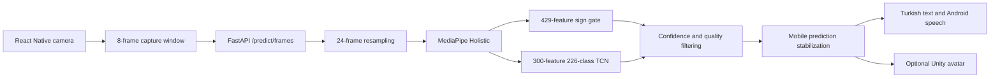

# TSLRecognition

TSLRecognition is an end-to-end Turkish Sign Language recognition system built
around a React Native mobile client, a FastAPI inference backend, and a
landmark-based temporal deep-learning pipeline. The application captures short
camera sequences, performs MediaPipe landmark extraction and model inference in
the backend, and stabilizes accepted predictions for Turkish text, Android
speech, and an optional 3D avatar workflow.

## Results at a Glance

| Model        | Classes | Validation Top-1 | Validation Top-5 | Test Top-1 | Test Top-5 |
| ------------ | ------: | ---------------: | ---------------: | ---------: | ---------: |
| Landmark TCN |     226 |           88.23% |           97.76% |     86.56% |     98.24% |

The validated application path is a React Native Android client backed by
FastAPI, PyTorch, and MediaPipe. Recognition runs in the backend; the repository
does not currently implement on-device ML inference.

## Key Features

- Live camera capture with short temporal frame windows
- MediaPipe Holistic extraction for pose, hand, and face landmarks
- A binary temporal sign/no-sign gate designed to reduce idle or non-sign
  predictions
- A 226-class residual Temporal Convolutional Network (TCN)
- Top-5 predictions plus confidence, margin, motion, and landmark-visibility
  quality checks
- Mobile-side temporal stabilization before predictions are committed
- Turkish text composition, translation history, and Android text-to-speech
- Optional Android Unity view integration for 3D sign playback
- Preserved training configurations, logs, evaluation summaries, class-level
  metrics, signer-level metrics, and early experiment artifacts

## Architecture



The mobile client captures eight JPEG snapshots with a 90 ms delay between
captures.
The backend decodes the uploaded sequence and resamples it to the 24 frames
expected by the models. The word classifier and binary gate run on separate
feature representations derived from the same MediaPipe output. Their results
are combined with quality checks before the mobile client applies repeat,
confidence, and top-score-margin rules.

## Model Development

### Final 226-Class Landmark TCN

The final word classifier consumes sequences of 24 frames with 300 normalized
landmark features per frame. Its architecture projects each frame to a hidden
size of 384, applies three residual temporal convolution blocks with dilations
1, 2, and 4, concatenates temporal mean and max pooling, and produces logits
for 226 classes.

| Property              |            Value |
| --------------------- | ---------------: |
| Training samples      |           28,142 |
| Validation samples    |            4,418 |
| Test samples          |            3,742 |
| Trainable parameters  |        2,951,098 |
| Hidden size           |              384 |
| Dropout               |              0.4 |
| Loss                  | CrossEntropyLoss |
| Optimizer             |            AdamW |
| Initial learning rate |            0.001 |
| Weight decay          |           0.0003 |
| Batch size            |               64 |
| Best checkpoint epoch |               47 |

The training configuration is available in
[`ml/configs/landmark_tcn_full.yaml`](ml/configs/landmark_tcn_full.yaml). The
sample counts and parameter count are recorded in
[`ml/evaluation/final/train.log`](ml/evaluation/final/train.log).

The results shown at the top of this README come from the stored
[`validation`](ml/evaluation/final/validation/summary.json) and
[`test`](ml/evaluation/final/test/summary.json) summaries. Class-level,
signer-level, and confusion artifacts are retained alongside each summary.

### Sign / No-Sign Gate

The binary gate is a separate temporal TCN that uses 429 motion-oriented
features per frame, a hidden size of 128, and two output classes. It was added
to reduce arbitrary word predictions when the camera sequence does not contain
a sign.

The production checkpoint records its best validation accuracy as **98.34% at
epoch 12**. A separate sign-only test artifact evaluates 3,742 sign samples at
a threshold of 0.8: sign recall is **99.97%**, with one sign sample rejected.
This report does not include a held-out no-sign specificity or false-positive
measurement, so no such claim is made here.

The runtime backend currently uses a gate threshold of **0.3**, while the
preserved sign-only evaluation used **0.8**. Configuration and evaluation files
are available at [`ml/configs/sign_gate.yaml`](ml/configs/sign_gate.yaml) and
[`ml/evaluation/sign_gate/`](ml/evaluation/sign_gate/).

### Earlier Transformer Experiments

Before the final TCN pipeline, a 20-class landmark Transformer was used for
architecture and data-scale exploration. These results are historical
validation results and are not the production model.

| Experiment                     | Validation Top-1 | Macro F1 |
| ------------------------------ | ---------------: | -------: |
| 25 training samples per class  |           53.13% |   50.18% |
| 100 training samples per class |           72.15% |   71.01% |
| Full 20-class training split   |           80.17% |   79.09% |

The source and preserved reports are under
[`ml/experiments/transformer20/`](ml/experiments/transformer20/). The latter
two runs retain evaluation JSON and summaries, but not their checkpoints.

## Repository Structure

```text
.
├── mobile/                      # React Native Android client and iOS scaffold
│   ├── src/                     # Screens, services, and UI logic
│   ├── android/                 # Android app and optional Unity integration
│   └── ios/                     # iOS scaffold (not validated end to end)
├── server/
│   ├── app/                     # FastAPI routes and inference pipeline
│   ├── models/                  # Production checkpoints and class metadata
│   └── scripts/                 # Model setup and validation utilities
├── ml/
│   ├── src/chatsl_ml/           # Training, preprocessing, and evaluation code
│   ├── configs/                 # Final, balanced, and gate configurations
│   ├── evaluation/              # Preserved final and experimental metrics
│   ├── experiments/transformer20/
│   └── tests/
├── README.md
└── .gitignore
```

## Setup

### Prerequisites

- Node.js 22.11 or newer
- Python 3 with virtual environment support
- Android Studio and an Android SDK for Android development

### Inference Backend

The two project-trained production checkpoints are included in
`server/models/`. The MediaPipe Holistic model bundle is not tracked and must
be downloaded with the provided checksum-verifying script.

```bash
cd server
python3 -m venv .venv
source .venv/bin/activate
pip install -r requirements.txt
python scripts/download_holistic_model.py
uvicorn app.main:app --reload --host 0.0.0.0 --port 8000
```

Backend endpoints:

- `GET /health` reports model-asset readiness.
- `POST /predict/image` accepts one image.
- `POST /predict/frames` accepts a multipart temporal frame sequence.

See [`server/models/README.md`](server/models/README.md) for model roles and
the expected MediaPipe asset checksum.

### Mobile Client

Install dependencies and start Metro from the mobile project directory:

```bash
cd mobile
npm ci
npm start
```

In another terminal, run Android:

```bash
cd mobile
npm run android
```

The app can discover a backend on the local network, checks
`http://10.0.2.2:8000` for the Android emulator, and also allows the backend URL
to be edited in Settings.

The repository contains a React Native iOS scaffold, but the camera/inference
flow has not been validated end to end on iOS. Its current `Info.plist` does not
define the camera usage description required by Vision Camera, and the
Android-native speech, network, and Unity modules do not have iOS counterparts.
Android is therefore the currently supported mobile setup documented here.

### ML Code

The ML source is organized to run from the `ml/` working directory. Raw data
and extracted landmark caches must be supplied separately before training.

```bash
cd ml
python3 -m venv .venv
source .venv/bin/activate
pip install -r requirements.txt
PYTHONPATH=src python -m unittest discover -s tests
```

Training and evaluation entry points are documented in
[`ml/README.md`](ml/README.md).

## Model Files

- `server/models/landmark_tcn_full.pt`: project-trained 226-class production
  checkpoint
- `server/models/sign_gate.pt`: project-trained binary sign/no-sign checkpoint
- `server/models/holistic_landmarker.task`: MediaPipe runtime asset, downloaded
  locally and verified against the SHA-256 recorded by the setup script

The production checkpoints are tracked directly because both are below
GitHub's individual file-size limit. The MediaPipe `.task` file remains local.

## Dataset and Reproducibility

The repository includes training and evaluation source code, model
configurations, production checkpoints, logs, and evaluation artifacts. It does
not include raw training videos, extracted landmark caches, private no-sign
recordings, or the split manifests required to recreate every recorded run.

As a result, the code path and model configuration are inspectable, but the
training runs are only partially reproducible from this repository alone. The
available repository evidence does not fully document the provenance and
redistribution terms of the final raw dataset, so this README does not make a
dataset ownership or redistribution claim.

## Optional 3D Sign Avatar

The Android client contains an embedded Unity view integration for interactive
avatar playback. Local Unity-enabled builds can load the exported runtime and
use the existing avatar controls. The default clean-clone configuration keeps
Unity disabled, allowing Android to build without the export; the Avatar screen
retains its normal controls and shows an explanatory card only in the 3D render
area.

Third-party avatar, animation, and Unity runtime source assets are not included
in this repository. The module remains an optional, actively developed output
path rather than part of the recognition model. Local enablement requires a
Unity export under `mobile/android/unityExport/` and `enableUnityAvatar=true`
in the ignored `mobile/android/local.properties` file.

## Tech Stack

- React Native and TypeScript
- React Native Vision Camera
- FastAPI and Pydantic
- Python, PyTorch, NumPy, and OpenCV
- MediaPipe Holistic Landmarker
- Kotlin and Android native modules
- Unity as an optional Android avatar renderer

## Limitations

- Raw training data and generated landmark caches are not distributed here.
- Reported metrics describe the preserved validation and test splits; broader
  signer, camera, lighting, and domain generalization require further study.
- Live inference latency depends on the mobile device, network, backend
  hardware, and MediaPipe processing time.
- Recognition quality depends on landmark visibility and motion quality.
- The optional avatar vocabulary depends on separately managed Unity runtime
  assets that are not distributed in this repository.
